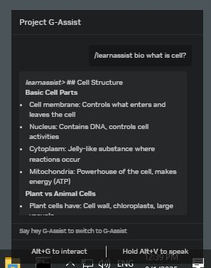

# LearnAssist: A Learning Assistant Plugin for NVIDIA Project G-Assist
Transform your gaming PC into a powerful learning companion! This G-Assist plugin leverages context engineering to help students get better AI-powered educational support. Because your gaming PC isn't just for gaming – it's a versatile tool that can support your studies and learning journey.

Learn more about NVIDIA G-Assist [here](https://github.com/NVIDIA/G-Assist).

## What Can It Do?
- 📚 Provide contextual educational support across multiple subjects
- 🎯 Use local markdown files as knowledge base for enhanced AI responses
- 📖 Support for English, Math, Physics, Chemistry, and Biology
- 🔧 Context engineering approach for better small language model performance
- 📝 Easy-to-update content system using simple markdown files
- 💡 Smart question answering using subject-specific educational context

## 🔬 About This Project

### Context Engineering Approach for Learning
This LearnAssist plugin uses **context engineering** to transform NVIDIA G-Assist into a learning assistant. Instead of relying solely on the base language model's knowledge, it provides G-Assist with focused educational content from local markdown files, enabling more accurate and relevant educational responses.

### Proof of Concept (POC) Build
**Important:** This is currently a **Proof of Concept build** with the following limitations:
- ⚠️ **Cannot process lengthy or complex questions** - Works best with direct, specific questions
- ⚠️ **Limited to basic educational concepts** - Advanced topics may not be fully covered
- ⚠️ **Simple keyword matching** - More sophisticated question understanding coming in future versions

### Open Source Development
This learnassist plugin is an **open source project** developed for the **NVIDIA G-Assist Plugins Hackathon competition**. It was built using the weather plugin example as a reference to demonstrate how gaming PCs can be transformed into powerful educational tools.

### Future Development
More complex and powerful functions will be added in **future hackathons and development cycles**. This project serves as a foundation for:
- Advanced natural language processing
- Multi-step problem solving
- Interactive learning sessions
- Expanded subject coverage
- Integration with external educational APIs

### 🤝 Contributions Welcome!
This is an **open source project** and we welcome your contributions for:
- **Context Enhancement**: Add or improve educational content in markdown files
- **Feature Development**: Implement new learning assistant capabilities  
- **Subject Expansion**: Add new subjects and educational domains
- **Bug Fixes**: Help improve reliability and performance
- **Documentation**: Enhance setup guides and usage examples

**Customize Your Learning**: You can modify the context files (`eng.md`, `math.md`, `phy.md`, `chem.md`, `bio.md`) to help and support your specific learning needs with NVIDIA G-Assist!

## 🎮 Why Use Your Gaming PC for Learning?
Your gaming PC has powerful hardware that's perfect for AI-assisted learning:
- **High-performance GPU**: Perfect for running AI models locally
- **Always available**: Your gaming setup becomes a 24/7 study companion
- **Local AI**: You can use your local AI for unlimited and private learning and study chats 

## 📋 Before You Start
Make sure you have:
- 🖥️ Windows PC (gaming PC recommended!)
- 🐍 Python 3.12
- 🤖 NVIDIA G-Assist installed
- 📁 Basic understanding of markdown files

## ✅ Tested Environment
This plugin has been tested and verified on:
- **OS:** Windows 10
- **GPU:** NVIDIA GeForce RTX 5080
- **G-Assist:** 0.1.13
- **Python:** 3.12

## 🚀 Quickstart

### 📥 Step 1: Get the Files
```cmd
git clone https://github.com/victortong-git/learn-assist.git
```
This downloads all the necessary files to your computer.

### ⚙️ Step 2: Setup and Build
1. **Run the setup script:**
```cmd
setup.bat
```
This installs all required Python packages automatically.

2. **Run the build script:**
```cmd
build.bat
```
This creates the executable and prepares all necessary files for installation.

### 📦 Step 3: Install the Plugin

**Option A: Automatic Installation (Recommended)**
Run the deployment script with administrator privileges:
```cmd
deploy.bat
```
This will automatically remove any old plugin files and copy the new build to the G-Assist plugins directory.

**Option B: Manual Installation**
1. Navigate to the `dist` folder created by the build script
2. Copy the `learnassist` folder to:
```cmd
%PROGRAMDATA%\NVIDIA Corporation\nvtopps\rise\plugins
```

💡 **Important Notes:**
- **Administrator privileges required** for both installation methods
- Make sure G-Assist is **not running** during installation
- All files must be copied, including:
  - The executable (`learnassist-plugin.exe`)
  - `manifest.json`
  - All subject markdown files (`.md` files)

## 📚 How to Use

Once everything is set up, you can get educational help through simple chat commands using the subject prefix syntax.

### 🎯 Command Format
Use the pattern: `[subject] [your question]`

### 📖 Available Subjects
The plugin comes with pre-loaded educational content for:
- **eng** (or english) - Grammar, writing, literature
- **math** (or mathematics) - Algebra, geometry, calculus  
- **phy** (or physics) - Mechanics, electricity, thermodynamics
- **chem** (or chemistry) - Atomic structure, chemical reactions, organic chemistry
- **bio** (or biology) - Cell biology, genetics, ecology

💡 **Note**: Content is stored in markdown files with short names (`eng.md`, `math.md`, `phy.md`, `chem.md`, `bio.md`), but you can use either short or long subject names in your commands.

### 💬 Example Commands
Try these commands with G-Assist using `/learnassist [subject] [question]` format:

**English:**
- `/learnassist eng what is noun?`
- `/learnassist eng what is adjective?`
- `/learnassist eng how do I use verbs?`

**Math:**
- `/learnassist math what is fraction?`
- `/learnassist math how to solve algebra?`
- `/learnassist math what is geometry?`

**Physics:**
- `/learnassist phy what is force?`
- `/learnassist phy what is energy?`
- `/learnassist phy what are newton laws?`

**Chemistry:**
- `/learnassist chem what is atom?`
- `/learnassist chem what are elements?`
- `/learnassist chem what is photosynthesis?`

**Biology:**
- `/learnassist bio what is cell?`
- `/learnassist bio what is photosynthesis?`
- `/learnassist bio what is respiration?`

### 📸 Biology Example in Action
Here's a real example of LearnAssist helping with biology questions:



*Example showing LearnAssist providing focused answers about biological concepts using G-Assist.*

### 📋 Example Response
When you ask a question like `/learnassist eng what is noun?`, the plugin will:
1. Process your question to identify you're asking about nouns
2. Extract relevant information from the `eng.md` educational content
3. Return a focused answer: "**Nouns** - People, places, things, or ideas. Examples: cat, school, love, teacher, book, happiness. Types: Common (dog), Proper (London), Abstract (freedom)"
4. G-Assist uses this focused answer to provide natural educational assistance

## 🔧 Customizing Your Learning Content

### ➕ Adding New Subjects
1. Create a new markdown file in the plugin directory (e.g., `history.md`)
2. Add your educational content using markdown formatting
3. Update the `manifest.json` if needed
4. Rebuild the plugin using `build.bat`

### ✏️ Updating Existing Content
1. Open any of the subject `.md` files (e.g., `math.md`, `phy.md`, `eng.md`)
2. Add or modify content using standard markdown syntax
3. Save the file
4. Rebuild using `build.bat` to apply changes

### 📝 Markdown File Structure
Each subject file should include:
```markdown
# Subject Name

## Main Topics
- Topic 1
- Topic 2

## Detailed Explanations
### Subtopic 1
Content here...

### Subtopic 2
Content here...
```

## 🔍 Troubleshooting Tips

### 📊 Logging
The plugin logs all activity to:
```
%USERPROFILE%\learnassist-plugin.log
```
Check this file for detailed error messages and debugging information.

### ❗ Common Issues
- **"Educational content for subject 'X' not found"**: Make sure the markdown file exists with correct name (eng.md, math.md, phy.md, chem.md, bio.md)
- **"Educational content for subject 'X' is empty"**: Check that your markdown file has content
- **"Both 'subject' and 'question' parameters are required"**: Ensure you're providing both subject and question in your command
- **Plugin not responding**: Verify the plugin is properly installed in the G-Assist plugins directory
- **Available subjects reminder**: Plugin will respond with "Available subjects: eng/english, math, phy/physics, chem/chemistry, bio/biology" when subject is not found

### 🧪 Testing Your Setup
Use the provided test file:
```cmd
how_to_test.md
```
This contains instructions for manually testing your plugin functionality.

## 👨‍💻 Developer Documentation

### 🏗️ Plugin Architecture
The learnassist plugin is built as a Python-based G-Assist plugin that processes educational questions and returns focused answers directly to G-Assist. Similar to how weather plugins process weather data or stock plugins process market data, learnassist processes educational content from local markdown files using keyword matching and content extraction to provide targeted learning assistance.

**Key Processing Flow:**
1. **Subject Mapping**: Maps both short (eng, phy, chem, bio) and long names (english, physics, chemistry, biology) to correct markdown files
2. **Keyword Matching**: Uses a comprehensive topic keyword system to identify what the student is asking about
3. **Content Extraction**: Extracts relevant sections from markdown files based on matched topics
4. **Focused Response**: Returns targeted educational answers directly to G-Assist (not context prompts)

### 🔧 Core Components

#### Command Handling
- `read_command()`: Reads JSON-formatted commands from G-Assist's input pipe
- `write_response()`: Sends JSON-formatted responses back to G-Assist
- Uses Windows API for secure pipe communication

#### Educational Question Processing
- `get_learning_context()`: Main function that processes educational questions and handles subject mapping
- `process_educational_question()`: Analyzes student questions using keyword matching to identify topics
- `extract_topic_info()`: Extracts focused information from educational content based on matched keywords
- **Subject Mapping System**: Maps both short and long subject names to markdown files (eng/english → eng.md)
- **Keyword Matching**: Recognizes topics like adjective, noun, verb, atom, force, energy, fraction, algebra, etc.
- Returns direct educational answers like other G-Assist plugins

### 🔍 Supported Topics and Keywords

The plugin uses intelligent keyword matching to identify what students are asking about:

**English/Grammar Topics:**
- **Adjectives**: adj, adjective, adjectives
- **Nouns**: noun, nouns  
- **Verbs**: verb, verbs
- **Adverbs**: adverb, adverbs
- **Tenses**: tense, tenses
- **Grammar**: grammar, punctuation

**Science Topics:**
- **Biology**: photosynthesis, respiration, cellular respiration, cell, cells
- **Chemistry**: atom, atomic, atoms, element, elements
- **Physics**: force, forces, newton, law, energy, kinetic, potential, motion, velocity, acceleration

**Math Topics:**
- **Fractions**: fraction, fractions
- **Algebra**: algebra, equation, solve
- **Geometry**: geometry, triangle, circle, area

### 📂 Subject File Mapping

The plugin maps subject names to markdown files as follows:
- `eng` or `english` → `eng.md`
- `math` or `mathematics` → `math.md`  
- `phy` or `physics` → `phy.md`
- `chem` or `chemistry` → `chem.md`
- `bio` or `biology` → `bio.md`

### ⚙️ Content Extraction Process

The plugin uses a sophisticated extraction algorithm to provide focused answers:

1. **Question Analysis**: Converts student question to lowercase and searches for topic keywords
2. **Topic Identification**: Matches keywords against the comprehensive topic dictionary
3. **Content Scanning**: Scans the appropriate markdown file for sections containing the identified keywords
4. **Smart Extraction**: 
   - Starts capturing when topic keywords are found
   - Continues until another major section (##) or different topic is encountered
   - Stops when sufficient content (6-10 lines) is captured
   - Formats the result by removing excessive blank lines
5. **Fallback Response**: If no specific topic is found, provides subject-specific helpful suggestions

**Extraction Features:**
- Captures relevant headings, bullet points, and examples
- Maintains markdown formatting for clear presentation
- Limits content length to avoid overwhelming responses
- Handles multiple sections within the same topic area

### 📋 Available Commands

#### `initialize`
Initializes the plugin and sets up the environment.
- No parameters required
- Returns: `{"success": true, "message": "Plugin initialized"}`

#### `shutdown`
Gracefully terminates the plugin.
- No parameters required
- Returns: `{"success": true, "message": "Plugin shutdown"}`

#### `get_learning_context`
Provides educational context from local markdown files to enhance AI responses for student learning assistance.
- Parameters:
  ```json
  {
    "subject": "string",  // Required: The subject prefix (e.g., 'english', 'math', 'physics', 'chemistry', 'biology') to load the corresponding markdown file
    "question": "string"  // Required: The student's question that needs to be answered using the educational context
  }
  ```
- Returns:
  ```json
  {
    "success": true,
    "message": "**Nouns** - People, places, things, or ideas. Examples: cat, school, love..."
  }
  ```

### 🔄 Command Processing
Input Format:
```json
{
    "tool_calls": [
        {
            "func": "get_learning_context",
            "params": {
                "subject": "eng",
                "question": "what is noun?"
            }
        }
    ]
}
```

Output Format:
```json
{
    "success": true,
    "message": "**Nouns**\n- People, places, things, or ideas\n- Examples: cat, school, love, teacher, book, happiness\n- Types: Common (dog), Proper (London), Abstract (freedom)"
}
```

### 🛠️ Dependencies
- Python 3.6+
- Standard library modules:
  - json: For message serialization/deserialization
  - logging: For operation logging
  - os: For file path operations
  - ctypes: For Windows API interaction

### ➕ Adding New Educational Functions
To add a new educational function:
1. Implement the function with signature: `def new_function(params: dict = None) -> dict`
2. Add the function to the `commands` dictionary in `main()`
3. Update `manifest.json` with the new function definition
4. Test manually using the testing procedures in `how_to_test.md`
5. Rebuild and reinstall the plugin

## 🚀 Next Steps & Enhancement Ideas
- **📱 Mobile sync**: Sync learning progress across devices
- **🎯 Progress tracking**: Track learning milestones and achievements
- **👥 Study groups**: Collaborative learning features
- **🔍 Smart search**: Advanced content search across all subjects
- **📊 Analytics**: Learning pattern analysis and recommendations
- **🌐 Online resources**: Integration with educational websites and APIs
- **🎨 Interactive content**: Support for images, diagrams, and multimedia
- **🧠 Adaptive learning**: Personalized content based on learning style

## 🤝 Want to Contribute?
We'd love your help making this educational plugin even better! Here's how you can contribute:

- 📝 **Add educational content**: Create new subject markdown files
- 🐛 **Report bugs**: Help us identify and fix issues
- 💡 **Suggest features**: Share ideas for new educational features
- 🔧 **Code contributions**: Improve the plugin functionality
- 📚 **Documentation**: Help improve setup guides and examples

Check out [CONTRIBUTING.md](CONTRIBUTING.md) for detailed guidelines on how to contribute.

## 📄 License
This project is licensed under the Apache License 2.0 - see the [LICENSE](LICENSE) file for details.

## 🙏 Acknowledgments
- 🏆 **Built for the NVIDIA G-Assist Plugins Hackathon competition**
- 🌦️ **Inspired by the G-Assist weather plugin example**
- 🎮 **Powered by NVIDIA G-Assist technology**
- 📚 **Educational content inspired by standard curriculum guidelines**
- 🔧 **Built with Python and Windows API integration**
- 🤖 **Enhanced by context engineering techniques for better AI responses**

---

*Transform your gaming PC into the ultimate learning companion! 🎮📚*
